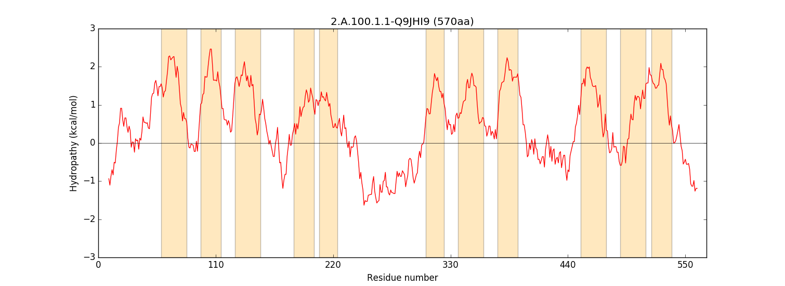
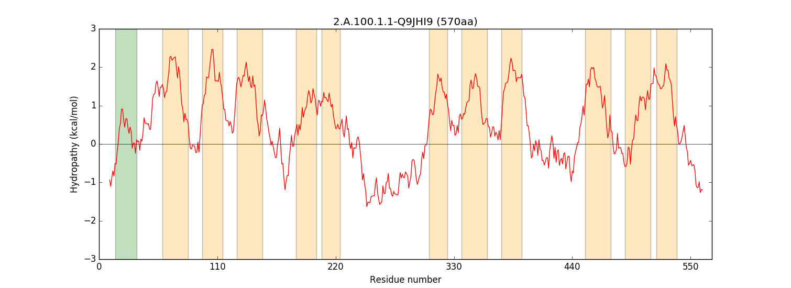
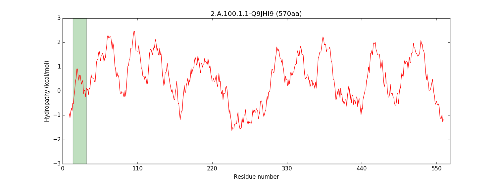
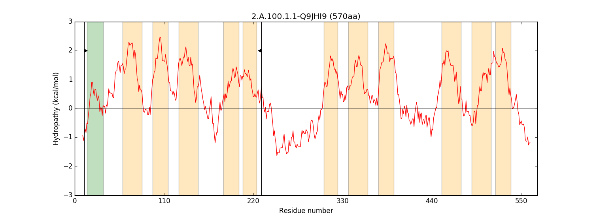
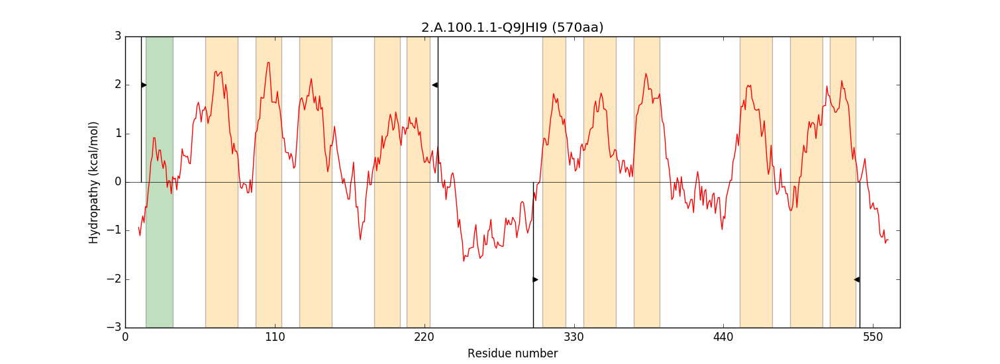
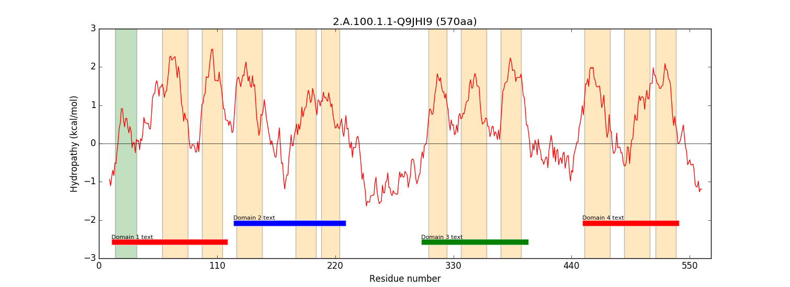
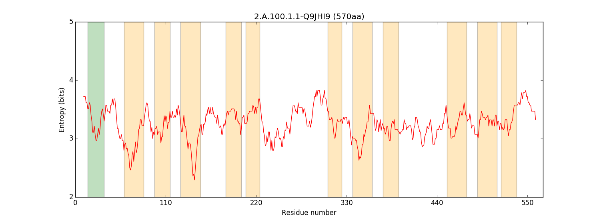

<!--General layout and various text copied from https://github.com/SaierLaboratory/TCDBtools/blob/master/manuals/famXpander.md-->

# Documentation for script: _quod.py_

## Summary
This script generates HTML reports with hydropathy plots and representations of TCDB BLAST hits (mostly replicating the [TCDB BLAST tool](http://www.tcdb.org/progs/blast.php)) for _Protocol2_ results. 
This script generates average hydropathy plots with arbitrary resolution in a variety of commonly used formats. 
This can be done on multiple sequences.
This tool mostly replicates [WHAT](http://biotools.tcdb.org/barwhat2.html).

## Dependencies
The following programs need to be available in your path for this program to run properly:

1. **_Python 2.7+_**  
Visit the [official website](https://www.python.org/). 
This program was not tested with more recent versions of Python but was implemented with some forward compatibility.

2. **_Matplotlib 1.5.1-2.0.0+_**  
Visit the [official website](https://matplotlib.org/).

## Command line options
The following options are available. 
You can also run the script without arguments (or with -h or --help) to display the options:

`infile+`	Sequence files to read in. Defaults to stdin (also known as pasting sequences manually) if unspecified

`-o`	What to name the resulting figure. QUOD automatically appends filenames now, but this behavior may change slightly in the future.

`-h`	Print help

`-a viewerpath` 
Viewer to use for opening plots

`-b x0 x1 x2 ... xn` 
Draw vertical bars without wedges at these positions

`-c color, --color color`
Color absolutely everything this color

`-d outdir`
Store all generated plots in outdir

`-q`
Don't open plots automatically

`-r dpi`
Resolution of plots in dpi. The default is 80dpi, which is acceptable for monitors and web viewing

`-s`
Force infile arguments to be interpreted as sequences

`-t formatstr`
Format of graph (png, eps, jpeg, jpg, pdf, pgf, ps, raw, rgba, svg, svgz, tif, tiff)

`-v`
Verbose output. Enables warnings

`-w/--walls x0-x[:y[:scale] [[x0-x[:y[:scale] ...]]`
Draw interval markers for intervals bounded by x0 and x with wedges pointing into the the interval. See below for examples

`-W x[:y[:scale] [x[:y[:scale]] ...]]`
Draw single interval markers at x pointing right for positive scale values and left for negative values of scale

`--axis-font-size`
Axis label size (pt)

`--height`
Plot height in inches (default: 5.5)

`--mode`
Modes to run QUOD in (hydropathy, entropy, psipred)

`--tick-font-size`
Tick label size (pt)

`--viewer`
Viewer to be used for opening plots

`--width`
Plot width in inches (default:dynamic)

`--window windowsize`
Window size for hydropathy plots

`--x-offset init_resi`
Sets starting x-value

`--xticks tickwidth` 
X tick spacing

`-ar x0-x[:color[:"label"] [x0-x[:color[:"label"]] ...]]`
Add colored rectangles with text labels. See below for examples

`-am [+id]:x1[,x2[,x3[...xn]]][:color]`
Add point markers at the specified x-positions on the hydropathy curve of the specified sequence

`-at x0-x[:color] [x0-x[:color]]`
Add TMSs to plot. See below for examples

`-dt [+id]:x0-x[,x0-x[,...]]`
Delete TMSs on plot overlapping with given ranges. See below for examples

`-et [+id:x0-x[,x0-x[,...]]]`
Extend TMSs on plot overlapping with given ranges. See below for examples

`-lt [+id1] fn1 [+id2 fn2]`
Load TMSs for specified sequences from specified files. See below for examples

`-nt [+id [+id [...]]]`
Erase all TMSs for specified sequences. See below for examples

`-rt [+id]:x0-x[:color] [[+id]:x0-x[:color]]...`
Replace TMSs on plot overlapping with specified TMSs. See below for examples

### Drawing examples ###

Here is an example QUOD plot generated without any special drawing options:


---

Supposing we wanted to place a green TMS spanning residues 15-35, we would use the `-at` option like so:

```
quod.py seq1.fa -at 15-35:green
```


---

We can, of course, purge the previously computed TMSs with the `-nt` option, which disables automatic TMS assignment for a list of sequence identifiers of the form +0, +1, +2, ... +n:
```
quod.py seq1.fa -at 15-35:green -nt +0
```


---

Where sequences are involved in alignments, it's often useful to mark the aligned region. This can be done with `-w`:
```
quod.py seq1.fa -at 15-35:green -w 12-230
```


---

`-w` can be used for sequences aligned with two separate partners, as often happens in Protocol1/2/GSAT. In these cases, specify y like so:
```
quod.py seq1.fa -at 15-35:green -w 12-230:2 300-540:-2
```


---

Domain analysis via PFAM is scheduled for inclusion into HVORDAN in the near future. The `-ar` option can help for plotting labeled regions:
```
quod.py seq1.fa -at 15-35:green -w 12-230 -ar 12-120:"Domain 1 text":-2.5:red 125-230:"Domain 2 text":-2:blue 300-400:"Domain 3 text":-2.5:green 450-540:"Domain 4 text":-2:red
```


---

Note that the quotes are necessary for labels with spaces

In some cases, it may be useful to determine the local informational entropy of a protein. The `-e` option switches QUOD to entropy-plotting mode:
```
quod.py seq1.fa -at 15-35:green -e
```

